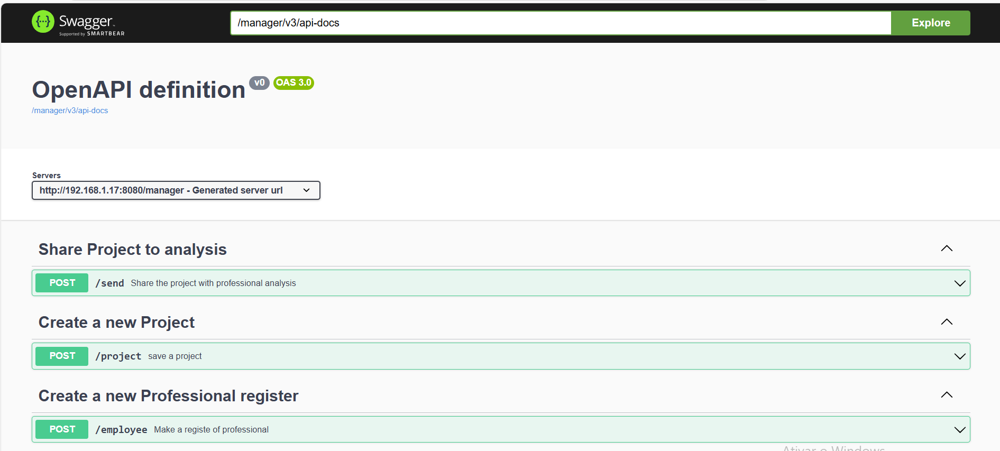
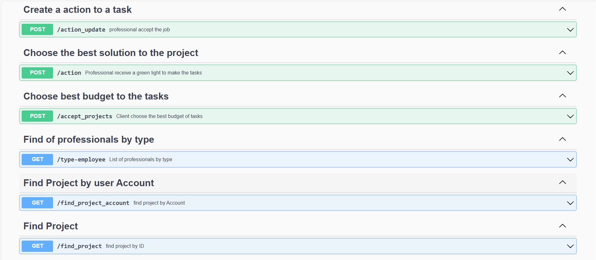
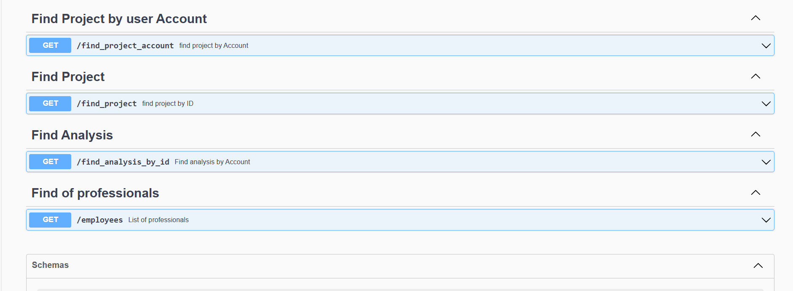

# Demo App with Composite Design Pattern

This demo application showcases a project management system that utilizes the composite design pattern. The application demonstrates how elements of this pattern can be represented within a project structure.

## Features

- **Account Creation**: Users can create an account to be represented in the system, which allows them to create projects for any issues they encounter.
- **Project Creation**: With an account, users can create projects and provide a description of the problem they are facing.
- **Solution Creation**: Registered professionals can propose solutions by creating tasks to address the problem.
- **Analysis Viewing**: Account owners can view all analyses related to their published projects.
- **Solution Selection**: Account owners can select the best solution for their project problems.
- **Professional Acceptance**: Professionals who analyze the project can choose whether or not to work on it.

## Setup


## Prerequisites
Before you start, make sure you have the following installed:

Java Development Kit (JDK): Version 17 or higher
Maven: Version 3.6 or higher
Docker: Version 20.10 or higher - Oprional
Docker Compose: Version 1.27 or higher (if using Docker Compose) - Optinal


### Running the Application with Maven

1. Clone the Repository
First, clone the repository to your local machine:

```bash
git clone <repository-url>
cd <repository-directory>
```

2. Build the Project

Use Maven to build the project. This command will compile the code and package it into a JAR file:

```bash
mvn clean install
```

3. Run the Application
To run the application locally using Maven, use:

```bash
mvn spring-boot:run
```


##### The application will create the necessary database tables programmatically at startup. Additionally, a .sql file containing the schema used by the application is available for reference.
 
If you do not have a PostgreSQL database configured in your environment, initialize it using Docker Compose:

```bash
docker-compose up
```
this command execute image docker from app and do the setting to allow the communication to  with system outside from docker container

```bash
docker run --net=host -p 8080:8080 jsn-composite
```


#### Access the Documentation

Access the application documentation via Swagger at:

http://localhost:8080/manager/swagger-ui/index.html








#### Contributing

If you would like to contribute to this project, please follow the guidelines in the CONTRIBUTING.md file.

#### License
This project is licensed under the MIT License.

#### Contact
For any questions or support, please contact jsn_13_13@hotmail.com.


